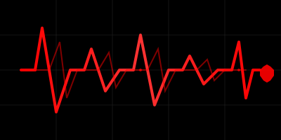

<div align="center">
  
  <h1>Pulse ⚡</h1>
  <p><strong>A lightweight reactive state engine</strong></p>
  <p>Automatically tracks dependencies between variables and UI components</p>
</div>

---

A lightweight reactive state engine that automatically tracks dependencies between variables and UI components, re-running functions when their dependencies change. Think of it as a mini-Svelte core - a powerful reactivity system with signals, stores, computed values, and a template compiler.

## What is Pulse?

Pulse is a **reactive state management framework** that makes it easy to build applications where data changes automatically trigger updates throughout your code. Instead of manually managing when to update your UI or recalculate values, Pulse tracks relationships between your data and automatically keeps everything in sync.

### Core Concept

When you create a **signal** (a reactive variable), any **computed values** or **effects** that read from it automatically become dependent on it. When the signal changes, all dependent computations and effects automatically re-run. This creates a reactive data flow where changes propagate automatically through your application.

### Key Benefits

- 🎯 **Automatic Dependency Tracking** - No need to manually specify what depends on what
- ⚡ **Fine-Grained Reactivity** - Only updates what actually changed
- 🧩 **Framework Agnostic** - Works with any JavaScript/TypeScript project
- 📦 **Lightweight** - Minimal overhead, maximum performance
- 🔧 **TypeScript First** - Full type safety out of the box

## Features

### Core Reactivity
- 🔄 **Signals** - Reactive variables that trigger updates when changed
- 🧮 **Computed Values** - Derived state that automatically recalculates when dependencies change
- 📦 **Stores** - Reactive objects with convenient partial update methods
- 🎯 **Effects** - Side effects that automatically re-run when dependencies change
- 🎯 **Automatic Dependency Tracking** - No manual dependency management needed

### Advanced Features
- ⚡ **Batch Updates** - Group multiple updates together for better performance
- 🔒 **Readonly Views** - Create read-only versions of signals for encapsulation
- ⚖️ **Custom Equality** - Prevent unnecessary updates with custom comparison functions
- 🔗 **Derived Stores** - Combine multiple signals into reactive object state
- 📋 **Signal Arrays** - Reactive arrays with push, pop, splice, and other array methods
- 🌐 **Async Computed** - Handle async operations with built-in loading and error states
- 🛡️ **Error Handling** - Global error handlers and error boundaries for robust applications
- 🔧 **Template Compiler** - Transform template syntax (like Handlebars) into JavaScript render functions
- 🔌 **Middleware/Interceptors** - Pipeline system for logging, validation, transformation
- 💾 **Persistence** - localStorage/sessionStorage integration with auto-save and hydration
- ✅ **Validation & Contracts** - Runtime type checking and schema validation
- ⏮️ **History & Undo/Redo** - Time-travel debugging with state snapshots
- ⏱️ **Debounce & Throttle** - Built-in utilities for rate limiting
- 🔄 **Lifecycle Hooks** - onCreated, onUpdated, onDestroyed hooks
- 🔀 **Transformers** - Map/filter/reduce operations on signals
- 👥 **Signal Groups** - Group related signals with batch operations
- 🔍 **Lenses** - Immutable updates with path-based access
- 🎯 **Conditional Subscriptions** - Subscribe only when conditions are met
- 💨 **Caching** - Smart caching with TTL and invalidation
- 🔗 **Synchronization** - Cross-tab/window state sync with BroadcastChannel
- 🧪 **Testing Utilities** - Helpers for testing signals in test suites
- 📊 **Performance Monitoring** - Built-in metrics and performance tracking
- 🔄 **Error Recovery** - Automatic error recovery with fallback values
- 🦥 **Lazy Evaluation** - Lazy computed values that only compute when accessed
- 🧠 **Memoization** - Memoized computed values with dependency tracking
- 📬 **Queues** - Queue system for managing signal updates
- ⚡ **Priorities** - Priority-based update scheduling
- 🌊 **Reactive Streams** - RxJS-like operators (map, filter, debounce, throttle, etc.)
- 🐛 **Debugging** - Enhanced debugging utilities with logging and tracing
- 🧠 **Memory Leak Detection** - Automatic detection of memory leaks
- 🏭 **Factory Patterns** - Counter, toggle, form, and other common patterns
- ⏱️ **Timers** - Reactive timers, intervals, and timeouts
- 👁️ **Observables** - Observable pattern integration (RxJS compatible)
- 🔄 **State Machine** - State machine pattern with signals
- 🎬 **Animations** - Signal-driven animations with easing functions
- 🌐 **WebSocket** - Reactive WebSocket integration with auto-reconnect
- 📊 **Dependency Graph** - Build and visualize signal dependency graphs
- 🔗 **Context API** - Context-based signal sharing (React-like)
- 🎯 **Selectors** - Selector pattern for derived state
- 🏗️ **Providers** - Provider pattern for dependency injection
- ⚡ **Enhanced Effects** - Effects with better cleanup and lifecycle
- ⚖️ **Comparators** - Deep/shallow equality and custom comparators
- 🔧 **Patchers** - Patch-based updates for objects (JSON Patch)
- 🔄 **Reducers** - Redux-like reducer pattern
- 📋 **Subscription Manager** - Manage multiple subscriptions
- 📡 **Event Emitter** - Event emitter pattern with signals
- 🔁 **Retry Logic** - Retry failed operations with backoff
- ⚡ **Circuit Breaker** - Circuit breaker pattern for fault tolerance
- 🚦 **Rate Limiter** - Rate limiting for signal updates
- 💨 **Backpressure** - Backpressure handling for high-frequency updates
- 📦 **Advanced Batching** - Priority, conditional, and scheduled batching

## Installation

```bash
npm install pulse
# or
pnpm add pulse
# or
yarn add pulse
```

## How It Works

Pulse uses a **dependency graph** to track relationships between your reactive values. When you read a signal inside a computed value or effect, Pulse automatically records that dependency. When the signal changes, Pulse knows exactly which computations need to update.

```typescript
const count = signal(0);           // Create a signal
const doubled = computed(() => {    // Create a computed value
  return count() * 2;               // Reading count() creates a dependency
});

// When count changes, doubled automatically recalculates
count.set(5);  // doubled() is now 10, automatically!
```

## Usage

### Basic Signals

```typescript
import { signal, computed, effect } from 'pulse';

// Create a reactive signal
const count = signal(0);

// Create a computed value
const doubled = computed(() => count() * 2);

// Create an effect that runs when dependencies change
effect(() => {
  console.log(`Count: ${count()}, Doubled: ${doubled()}`);
});

// Update the signal
count.set(5); // Logs: "Count: 5, Doubled: 10"
```

### Batch Updates

```typescript
import { batch, signal } from 'pulse';

const a = signal(0);
const b = signal(0);

// Batch multiple updates - effects only run once
batch(() => {
  a.set(1);
  b.set(1);
});
```

### Stores

```typescript
import { store } from 'pulse';

const user = store({ name: 'John', age: 30 });
user.setField('age', 31); // Partial update
user.update(u => ({ ...u, name: 'Jane' })); // Full update
```

### Signal Arrays

```typescript
import { array } from 'pulse';

const items = array([1, 2, 3]);
items.push(4); // Reactive push
items.pop(); // Reactive pop
const filtered = items.filter(x => x > 2); // Returns new SignalArray
```

### Async Computed

```typescript
import { asyncComputed, signal } from 'pulse';

const userId = signal(1);
const user = asyncComputed(async () => {
  const id = userId();
  const response = await fetch(`/api/users/${id}`);
  return response.json();
});

// Check loading state
if (user.loading()) {
  console.log('Loading...');
}

// Check for errors
if (user.error()) {
  console.error('Error:', user.error());
}

// Get value
const data = await user();
```

### Template Compiler

```typescript
import { compile } from 'pulse';

const template = compile(`
  <h1>{{ title }}</h1>
  {{#if show}}
    <p>{{ message }}</p>
  {{/if}}
  {{#each items as item}}
    <li>{{ item }}</li>
  {{/each}}
`);

const html = template.render({
  title: 'Hello',
  show: true,
  message: 'World',
  items: ['a', 'b', 'c']
});
```

## Use Cases

- **State Management** - Manage application state with automatic reactivity
- **UI Frameworks** - Build reactive UI frameworks or enhance existing ones
- **Data Binding** - Create two-way data binding systems
- **Form Validation** - Reactive form state with automatic validation
- **Real-time Updates** - Keep data synchronized across your application
- **Template Rendering** - Use the template compiler for server-side or client-side rendering

## Why Pulse?

Unlike traditional state management libraries that require you to manually trigger updates, Pulse automatically tracks dependencies and updates only what's necessary. This means:

- **Less Boilerplate** - No need to manually subscribe/unsubscribe
- **Better Performance** - Only updates what actually changed
- **Easier Debugging** - Clear dependency relationships
- **Type Safe** - Full TypeScript support with excellent autocomplete

## Development

```bash
# Install dependencies
npm install
# or
pnpm install

# Run tests
npm test
# or
pnpm test

# Build
npm run build
# or
pnpm build

# Watch mode for development
npm run dev
# or
pnpm dev
```

## Contributing

Contributions are welcome! Please feel free to submit a Pull Request.

## License

MIT License - see [LICENSE](LICENSE) file for details


